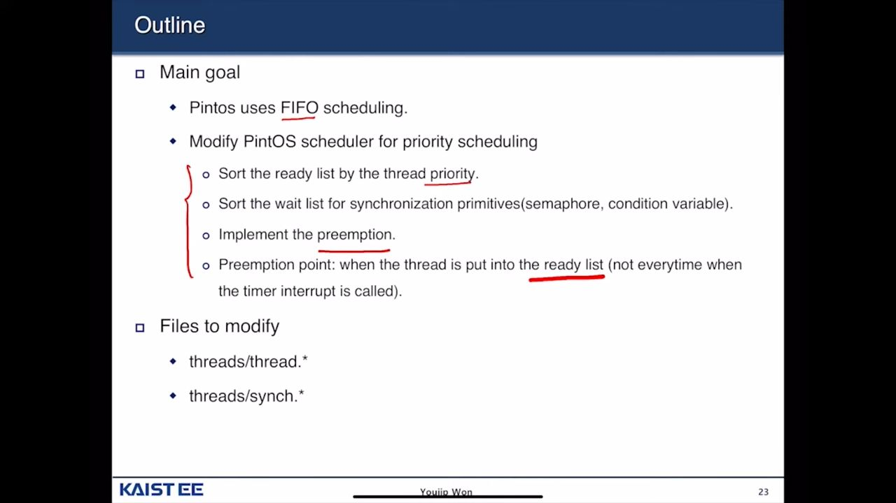

 
**[[Week02] Pintos Project1-1 Thread](https://www.youtube.com/watch?v=myO2bs5LMak)**

---

AI Title: The system for timer alarms will be modified to replace busy waiting with a sleep and wake-up paradigm.

**0:15 [Play](https://app.videonotebook.com/notebooks/56b17ffb-1634-4e6b-88aa-346d91ef1d4b/video/61c6c96b-91c7-4f56-b9cd-29f490c1cbda?noteId=44a374db-8a85-43bc-b147-d9f53b9ebf12&time=0:15&type=G)**

---

AI Title: A function is needed to return the minimum value of text while ensuring that code passes an alarm test, and there is a requirement to modify a scheduler for priority scheduling.

**13:13 [Play](https://app.videonotebook.com/notebooks/56b17ffb-1634-4e6b-88aa-346d91ef1d4b/video/61c6c96b-91c7-4f56-b9cd-29f490c1cbda?noteId=0c721e21-ca34-4bb3-8df9-a0588733094b&time=13:13&type=G)**

---

AI Title: The task involves modifying a scheduler to implement priority scheduling by sorting the ready list and wait list according to thread priorities and implementing preemption at designated points.

**13:35 [Play](https://app.videonotebook.com/notebooks/56b17ffb-1634-4e6b-88aa-346d91ef1d4b/video/61c6c96b-91c7-4f56-b9cd-29f490c1cbda?noteId=6daf8b9b-dc35-4af9-901d-7792c996603b&time=13:35&type=G)**

---

what to do in scheduler

**13:41 [Play](https://app.videonotebook.com/notebooks/56b17ffb-1634-4e6b-88aa-346d91ef1d4b/video/61c6c96b-91c7-4f56-b9cd-29f490c1cbda?noteId=1d3f0a98-c344-4c3a-948d-28d2cf3468c9&time=13:41&type=T)**

---

**14:25 [Play](https://app.videonotebook.com/notebooks/56b17ffb-1634-4e6b-88aa-346d91ef1d4b/video/61c6c96b-91c7-4f56-b9cd-29f490c1cbda?noteId=3a564a96-4dc2-444f-a822-b17d0a61cf89&time=14:25&type=G)**

---

AI Title: The scheduling algorithm checks for preemption only when a new thread arrives in the ready list, simplifying the process of selecting the next thread to run based on priority.

**14:27 [Play](https://app.videonotebook.com/notebooks/56b17ffb-1634-4e6b-88aa-346d91ef1d4b/video/61c6c96b-91c7-4f56-b9cd-29f490c1cbda?noteId=19279f1f-aec7-42c6-a419-ba0592d28d44&time=14:27&type=S)**

---

AI Title: When managing threads, the highest priority thread should be selected to run, and any new thread must have its priority compared against the currently running thread before insertion.

**14:57 [Play](https://app.videonotebook.com/notebooks/56b17ffb-1634-4e6b-88aa-346d91ef1d4b/video/61c6c96b-91c7-4f56-b9cd-29f490c1cbda?noteId=08081502-26e9-45d0-880b-c94e599fce58&time=14:57&type=G)**

---

mthree things to do in shceduler

**15:37 [Play](https://app.videonotebook.com/notebooks/56b17ffb-1634-4e6b-88aa-346d91ef1d4b/video/61c6c96b-91c7-4f56-b9cd-29f490c1cbda?noteId=bc3867ad-96b7-4f20-976e-360ec0f90d64&time=15:37&type=T)**

---

AI Title: Priority in Pintas ranges from 0 to a maximum value, affecting the selection of threads waiting for synchronization primitives like locks and semaphores based on their priority.

**15:50 [Play](https://app.videonotebook.com/notebooks/56b17ffb-1634-4e6b-88aa-346d91ef1d4b/video/61c6c96b-91c7-4f56-b9cd-29f490c1cbda?noteId=5a46b855-cdd3-41e6-a184-b5bbd35bf56a&time=15:50&type=S)**

---

AI Title: In Pintas, there are 64 priority levels ranging from 0 to 63, with a default priority value of 31 assigned when a thread is first created.

**15:55 [Play](https://app.videonotebook.com/notebooks/56b17ffb-1634-4e6b-88aa-346d91ef1d4b/video/61c6c96b-91c7-4f56-b9cd-29f490c1cbda?noteId=475a49b4-633c-4adf-b883-512f0dd892d4&time=15:55&type=G)**

---

edits in thread\_creat()

**17:02 [Play](https://app.videonotebook.com/notebooks/56b17ffb-1634-4e6b-88aa-346d91ef1d4b/video/61c6c96b-91c7-4f56-b9cd-29f490c1cbda?noteId=ac5cde3e-5d89-4c95-8c33-c6bf423189a9&time=17:02&type=T)**

---

AI Title: Maintaining a sorted list of threads by priority is costly due to the need for comparisons when inserting new threads.

**17:14 [Play](https://app.videonotebook.com/notebooks/56b17ffb-1634-4e6b-88aa-346d91ef1d4b/video/61c6c96b-91c7-4f56-b9cd-29f490c1cbda?noteId=e1f585ce-21f6-46ae-99fe-489b4ebd0ff3&time=17:14&type=S)**

---

AI Title: When unblocking a thread, the priorities of the currently running thread and the newly inserted thread should be compared, and if the new thread has a higher priority, it takes precedence.

**17:43 [Play](https://app.videonotebook.com/notebooks/56b17ffb-1634-4e6b-88aa-346d91ef1d4b/video/61c6c96b-91c7-4f56-b9cd-29f490c1cbda?noteId=1c04cf86-9d43-41e9-94fb-109717e3b376&time=17:43&type=G)**

---

AI Title: When a thread is unblocked from the ready state or yields, it must be reinserted into the scheduling list according to its priority.

**18:14 [Play](https://app.videonotebook.com/notebooks/56b17ffb-1634-4e6b-88aa-346d91ef1d4b/video/61c6c96b-91c7-4f56-b9cd-29f490c1cbda?noteId=7b469d08-7b9f-4dbe-9614-3be28ec70026&time=18:14&type=G)**

---

AI Title: The modification involves placing an unblocked thread in the red list according to its priority, rather than at the end of the list.

**19:48 [Play](https://app.videonotebook.com/notebooks/56b17ffb-1634-4e6b-88aa-346d91ef1d4b/video/61c6c96b-91c7-4f56-b9cd-29f490c1cbda?noteId=2c8a8c74-0479-410e-802b-79c16e342f26&time=19:48&type=S)**

---

hint on thread\_unblock

**19:48 [Play](https://app.videonotebook.com/notebooks/56b17ffb-1634-4e6b-88aa-346d91ef1d4b/video/61c6c96b-91c7-4f56-b9cd-29f490c1cbda?noteId=c2401c8c-3d69-44c2-9a1b-9580f0e8edef&time=19:48&type=T)**

---

AI Title: Synchronization primitives such as locks, semaphores, and condition variables must be managed to ensure that waiting threads are awakened according to their priority when resources become available.

**20:10 [Play](https://app.videonotebook.com/notebooks/56b17ffb-1634-4e6b-88aa-346d91ef1d4b/video/61c6c96b-91c7-4f56-b9cd-29f490c1cbda?noteId=6cdb997d-8337-42a6-b7e1-71ea2c1805fd&time=20:10&type=G)**

---

aquires sema -> sort waiters list according to priority edit => sema\_down() and cond\_wait()

**22:21 [Play](https://app.videonotebook.com/notebooks/56b17ffb-1634-4e6b-88aa-346d91ef1d4b/video/61c6c96b-91c7-4f56-b9cd-29f490c1cbda?noteId=6a66d1b7-1cee-418c-addc-a50719033397&time=22:21&type=T)**

---

AI Title: The basic functions of semaphores include initializing a semaphore, requesting access to it, and handling process synchronization.

**23:19 [Play](https://app.videonotebook.com/notebooks/56b17ffb-1634-4e6b-88aa-346d91ef1d4b/video/61c6c96b-91c7-4f56-b9cd-29f490c1cbda?noteId=7ac1d9c5-06c2-4905-addc-c80c35d7e4cf&time=23:19&type=G)**

---

locks implementation using semaphores

**24:24 [Play](https://app.videonotebook.com/notebooks/56b17ffb-1634-4e6b-88aa-346d91ef1d4b/video/61c6c96b-91c7-4f56-b9cd-29f490c1cbda?noteId=01da52d0-746c-4de3-972d-9a4d64306b88&time=24:24&type=T)**

---

AI Title: Lock implementation can be modified based on priority by altering the semaphore, and condition variables have four key functions: initialization, waiting, signaling, and broadcasting.

**24:24 [Play](https://app.videonotebook.com/notebooks/56b17ffb-1634-4e6b-88aa-346d91ef1d4b/video/61c6c96b-91c7-4f56-b9cd-29f490c1cbda?noteId=c25b1bf1-9f10-4ba5-b2ec-ba59b848de30&time=24:24&type=S)**

---

AI Title: There are four important functions related to condition variables: initialization, waiting for a signal, signaling the highest priority waiting thread, and broadcasting to all waiting threads.

**24:26 [Play](https://app.videonotebook.com/notebooks/56b17ffb-1634-4e6b-88aa-346d91ef1d4b/video/61c6c96b-91c7-4f56-b9cd-29f490c1cbda?noteId=03d42d4d-386f-4fcd-b832-47397dfcfbce&time=24:26&type=G)**

---

**24:49 [Play](https://app.videonotebook.com/notebooks/56b17ffb-1634-4e6b-88aa-346d91ef1d4b/video/61c6c96b-91c7-4f56-b9cd-29f490c1cbda?noteId=d9e691a0-496d-42ec-ba01-fa4f7e53ef0d&time=24:49&type=S)**

---

AI Title: Priority donation is a mechanism that addresses priority inversion by allowing a lower-priority thread holding a lock to inherit the higher priority of another waiting thread.

**27:37 [Play](https://app.videonotebook.com/notebooks/56b17ffb-1634-4e6b-88aa-346d91ef1d4b/video/61c6c96b-91c7-4f56-b9cd-29f490c1cbda?noteId=1b9ad348-7323-493c-9406-665d45e8eecd&time=27:37&type=G)**

---

AI Title: A lock is held by a thread with priority 10, while three other threads with priorities 9, 12, and 8 arrive without any priority donation mechanism in place.

**29:45 [Play](https://app.videonotebook.com/notebooks/56b17ffb-1634-4e6b-88aa-346d91ef1d4b/video/61c6c96b-91c7-4f56-b9cd-29f490c1cbda?noteId=d58580bb-c9f7-46ef-a482-3485dfeb85f6&time=29:45&type=G)**

---

AI Title: In a scenario involving three threads with varying priorities, the highest priority thread is holding a resource that may lead to nested donation issues.

**30:54 [Play](https://app.videonotebook.com/notebooks/56b17ffb-1634-4e6b-88aa-346d91ef1d4b/video/61c6c96b-91c7-4f56-b9cd-29f490c1cbda?noteId=cf6e3feb-62dd-4b99-a86f-e2d9fcae2809&time=30:54&type=G)**

---

AI Title: A thread holding three locks has its priority temporarily increased from 10 to 12 due to a higher-priority request for one of the locks.

**33:00 [Play](https://app.videonotebook.com/notebooks/56b17ffb-1634-4e6b-88aa-346d91ef1d4b/video/61c6c96b-91c7-4f56-b9cd-29f490c1cbda?noteId=23f5923e-b72f-4c21-99eb-f36f50cf1dbf&time=33:00&type=G)**

---

after unlocking C T1 must have the priority of the higher priority waiting threads (T2) that is waiting on lock A and do not re-own its original prriority(which was 10)

**34:47 [Play](https://app.videonotebook.com/notebooks/56b17ffb-1634-4e6b-88aa-346d91ef1d4b/video/61c6c96b-91c7-4f56-b9cd-29f490c1cbda?noteId=fdea5a04-7ba1-4233-bf74-6ebf7433c762&time=34:47&type=T)**

---

AI Title: A system must keep track of donors and their priorities to efficiently manage donations based on a waiting list.

**35:04 [Play](https://app.videonotebook.com/notebooks/56b17ffb-1634-4e6b-88aa-346d91ef1d4b/video/61c6c96b-91c7-4f56-b9cd-29f490c1cbda?noteId=a7133894-9d21-4de2-afe3-6fa61160acaf&time=35:04&type=G)**

---

implementation of priority donation for multiple (parallel donations)

by making list of donors in thread and seacrh for the highest priority donor in this list after unlocking specific lock

**35:12 [Play](https://app.videonotebook.com/notebooks/56b17ffb-1634-4e6b-88aa-346d91ef1d4b/video/61c6c96b-91c7-4f56-b9cd-29f490c1cbda?noteId=412ea2b6-3167-49f9-b3f8-8cb89a97e7d0&time=35:12&type=T)**

---

nested donation implementation

**35:41 [Play](https://app.videonotebook.com/notebooks/56b17ffb-1634-4e6b-88aa-346d91ef1d4b/video/61c6c96b-91c7-4f56-b9cd-29f490c1cbda?noteId=12e0061e-dea0-4e44-972c-821ff69488bf&time=35:41&type=T)**

---

AI Title: To implement nested priority donation, one must maintain the current luck, check if the inherited priority needs to be passed to a child, and modify both the initialization data structure and the luck function.

**35:41 [Play](https://app.videonotebook.com/notebooks/56b17ffb-1634-4e6b-88aa-346d91ef1d4b/video/61c6c96b-91c7-4f56-b9cd-29f490c1cbda?noteId=f8080325-bec9-428c-b1f5-051d0092cac5&time=35:41&type=S)**

---

functions to implement in priority donation

**35:56 [Play](https://app.videonotebook.com/notebooks/56b17ffb-1634-4e6b-88aa-346d91ef1d4b/video/61c6c96b-91c7-4f56-b9cd-29f490c1cbda?noteId=1edc227d-cdf0-4d71-9d67-78e2f7db34fc&time=35:56&type=T)**

---

### Idle_thread

In PintOS, idle_thread is a special kernel thread that runs when no other threads are ready to run. It's basically the OS's way of saying:
"I have nothing to do right now, so I'll just chill until something happens."