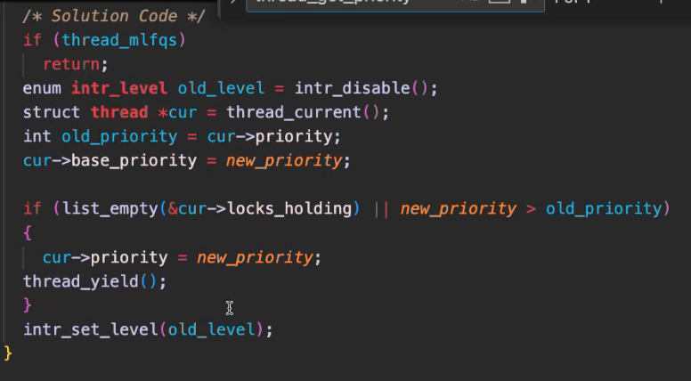
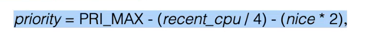
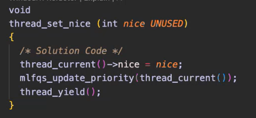

## 0. installation notes:
### In step 5:
- **DO NOT** go to the repo folder dir, stay where you are.
- copy this command (the one in the repo is not working):
```shell
docker run --platform linux/amd64 --rm -it -v "$(pwd)/CSEx61-dockerized-pintos:/root/pintos " 
```
then paste the **image ID** from docker


## 1. timer.c
- change `timer_sleep()` function (remove the bust waiting "while loop"), one way to do it is using **semaphores**.
- use `sema_down()` in `timer_sleep()` and `sema_up()` in `timer_interrupt()`
- init a **list** using `list.c` and use `list_ordered` where in the list (to reduce overhead)
```c
list = [{thread_id_1, ticks_no}, {thread_id_2, ticks_no}, {thread_id_3, ticks_no}]
```
where the list is ordered by the ticks number
- in `timer_interrupt()` go through the list and `sema_up()` the one with the right ticks number

## 2. priority scheduler
- you need to update `sema_up()` found in `synch.c` file (using `thread_yield()`)
- implement `thread_set_priority()` and `thred_get_priority()` functions.
- `thread_set_priority` video solution:
  
    
- `thred_get_priority()` should have **priority donation**, and return the donated priority, by updating `next_thread_to_run()`.
- **priority donation**:
  - if a thread (eg. `thread_2`) of **lower** priority has a lock and another thread (eg. `thread_1`) of **higher** priority is created and it wants the same lock, normally `thread_1` would have the highest priority of execution, but because `thread_2` has the lock and it should give `thread_2` the highest priority to release the lock so that `thread_1` can work.
  - `thread_2` will have the same priority of `thread_1` (*in term of numbers*) until `thread_2` releases the lock then it returns again to its original priority. 
- Based on:
    1. **locks**:
       1. lock_aquire()
       2. lock_release()
    2. **semaphores**:
       1. sema_up()
       2. sema_down()
    3. **condition variables**:
       1. cond_wait()
       2. cond_signal()
       3. cond_broadcast()

## 3. Advanced scheduler
- priority changes using a certain equation.
  
  
- after every interrupt update the thread priority.
- **nice values**: They are integers in the range of -20 to 20, where:
  - A lower nice value (e.g., -20) indicates a *higher* priority for the thread.
  - A higher nice value (e.g., 20) indicates a *lower* priority for the thread.
- **recent cpu**: how many ticks has the thread used the cpu for.
  
  
- **load_avg**: average number of threads ready to run over the past minute.

    

- for **nice values** and **recent cpu**:
  - you need to add them to the thread implementation in `thread.h` (eg. int nice; fixed_t recent_cpu)
  - complete the `thread_get_nice()`, `thread_set_nice()`, `thread_get_recent_cpu()` and `thread_set_recent_cpu()` functions.
  - video solution:
  
    